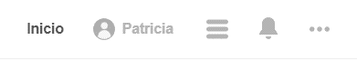

## Elige una web de tu preferencia y explica qué partes conforman el UX y qué partes el UI

### Pinterest

#### UX

+ Puedes tener una cuenta personal y también te da la opción de cambiar a una cuenta para empresas.

+ Te permite guardar ideas de Internet a partir del botón Pinterest, con un click, por ejemplo para:

1. Localizar sitios que visitar.
2. Guardar recetas que preparar.
3. Marcar artículos como favoritos para leerlos después.
4. Guardar ideas creativas para fiestas.

+ La web site está disponible en más de treinta idiomas.

+ En las notificaciones te recomiendan nuevos pines según tus preferencias.

+ Al guardar una imagen aparecen más recomendaciones que podrían ser de interés del usuario.

+ Se puede enviar mensajes a amigos para intercambiar ideas y compartir gustos o preferencias.

#### UI

+ El diseño de los botones de la barra de navegación.

+ El diseño del botón y el ícono de Guardar.

+ Las esquinas redondeadas y el efecto de hover al pasar el mouse sobre las imágenes.

